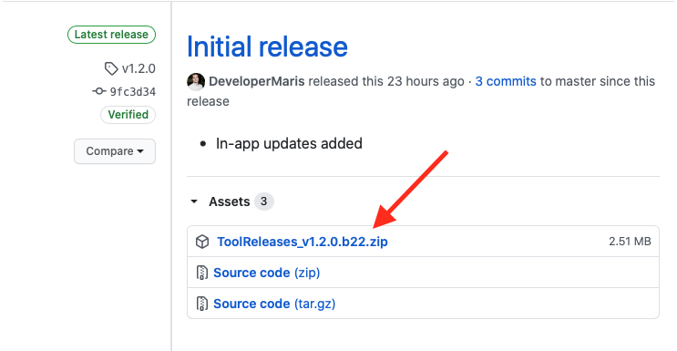
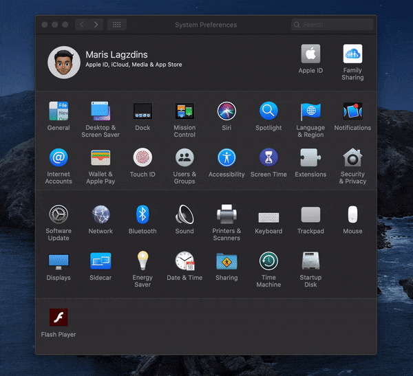

# Tool Releases

Be informed about the latest Apple tool releases (including *Beta* releases) with just one click from your computer.

This application for free retrieves, notifies and shows you the latest Apple tool releases (including *Beta* releases) from publicly available Apple [RSS feed](https://developer.apple.com/news/releases/rss/releases.rss) in a formatted list on your status bar so that you would not miss any new releases coming out.

# Screenshots

 

 

## Notification badge on the status icon

 

# Requirements

* macOS 11 (Big Sur)

# Features

* Displays a list of newest Apple tool releases;
* Automatic background refresh approximately once per hour;
* Notifies about the new releases by adding a badge to the status bar icon ([Notification badge on the status icon](#notification-badge-on-the-status-icon));
* Possibility to search for a specific tool by keywords (multiple keyword groups can be separated with **semicolons**, for example, *"iOS beta; macOS Big Sur"*) 
  * *(Note: Application will still notify you of any new tool releases, regardless of your currently searched keywords)*

# Install

## 1. Using [Homebrew](https://brew.sh)

1. Open Terminal.

2. Execute command `brew install --cask toolreleases`.

3. Open Launchpad and launch the **ToolReleases** app.

## 2. Manual installation

1. Open [latest release page](https://github.com/DeveloperMaris/ToolReleases/releases/latest) and download the application binary **ToolReleases_vX.X.X.bX.zip**.

2. Unarchive the **ToolReleases_vX.X.X.bX.zip** (it's possible, that downloaded file will be automatically unarchived, then you can skip this step).

3. Move the **ToolReleases.app** file to **Applications** directory.

4. Launch the **ToolReleases.app** file.

### Additional installation steps

macOS includes a technology called Gatekeeper, that's designed to ensure that only trusted software runs on your Mac, [more info here](https://support.apple.com/en-us/HT202491).

If app doesn't start right away after launching **ToolReleases.app** file and this warning appears:

1. Open **System Preferences** and navigate to **Security & Privacy** General tab.

2. At the bottom you will see something like <ins>*"ToolReleases" was blocked from use because it is not from an identified developer*</ins>, click on **Open Anyway**.

3. Prompt should appear (if not, launch the **ToolReleases.app** file again) and press **Open**.

*Note: these steps will be necessary only for the first application launch.*

# Launch at Login

If you want that **ToolReleases** application would automatically launch at login, then:

1. Open **System Preferences** and navigate to **Users & Groups**.
2. Select *user* on the left side of the settings.
3. Select **Login Items** tab
4. Click on the **+** button
5. Select **Applications** directory on the left side.
6. Search and select the **ToolReleases.app** and click **Add**

# Updates

Future application updates are available through the in-application settings.

# Licence

`Tool Releases` is released under the BSD 3-Clause License. See [LICENSE](LICENSE) for details.
